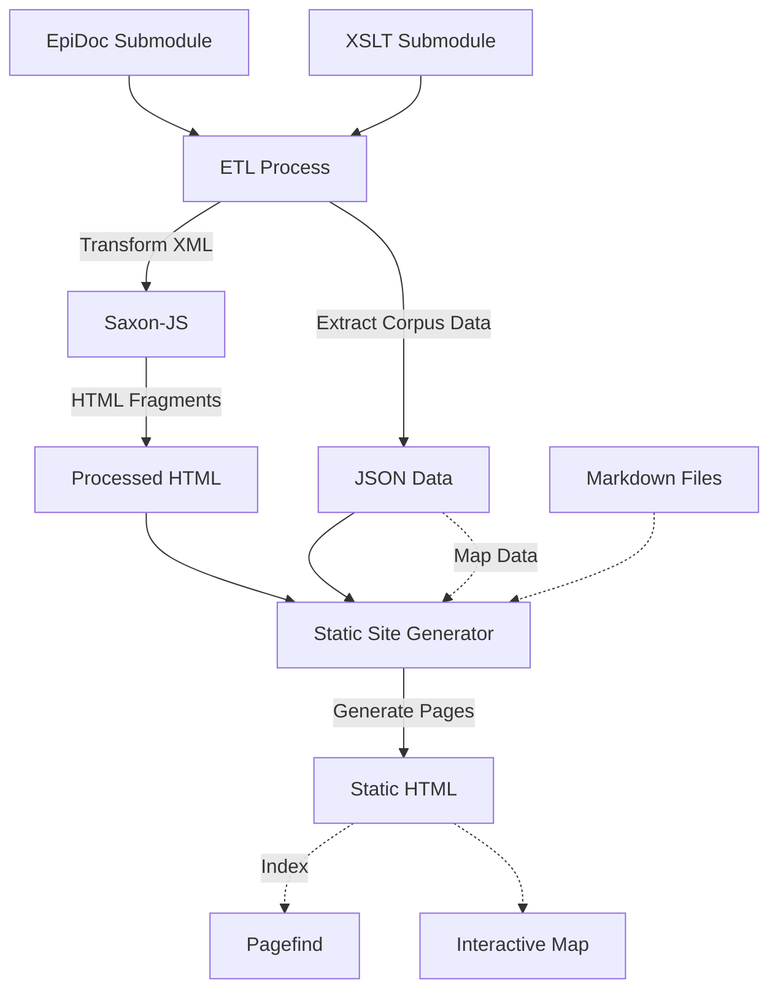

# Corpus Building

This project processes [EpiDoc](https://epidoc.stoa.org) [TEI](https://tei-c.org)
XML files and presents them as a static website.

It uses a monorepo structure with two main components: an [ETL](packages/etl)
(Extract, Transform, Load) process for handling XML files, and a web application
for presenting the processed data.

## Project structure

The main components of the project are:

- `packages/`
  - `etl/`: ETL package for processing XML
- `frontend/`: Static site generator web application
- `data/`
  - `processed/`: Output data generated by the `etl` package after processing the `raw` data
  - `raw/`: Git submodule for the EpiDoc files
- `xslt/`
  - `epidoc/`: Git submodule for XSLT stylesheets
  - `start-edition.sef.json`: Compiled version of the XSLT to convert the XML files into HTML

## Workflow



## Getting started

1. Clone this repository
1. Initialise and update the submodules

   ```sh
   git submodule update --init --recursive
   ```

1. Install dependencies

   ```sh
   npm install
   ```

1. Run the etl process

   ```sh
   npm run etl
   ```

1. Run the development server

   ```sh
   npm run frontend:dev
   ```

The project should be available at http://localhost:5173/.
