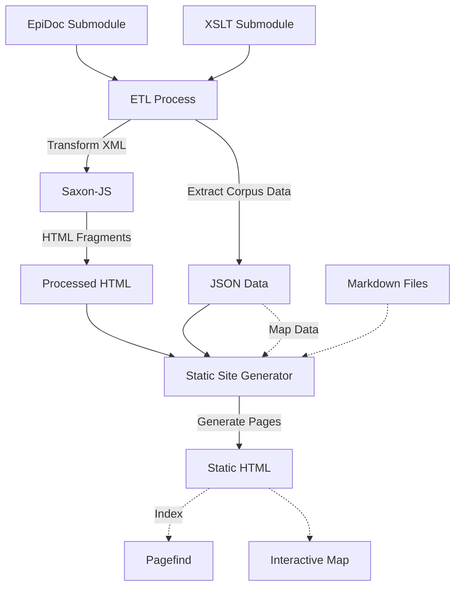

# Corpus Building

This project processes [EpiDoc](https://epidoc.stoa.org) [TEI](https://tei-c.org)
XML files and presents them as a static website.

It uses a monorepo structure with two main components: an [ETL](packages/etl)
(Extract, Transform, Load) process for handling XML files, and a
[web application](frontend/README.md) for presenting the processed data.

## Project structure

The main components of the project are:

- `packages/`
  - `etl/`: ETL package for processing XML
- `frontend/`: Static site generator web application
- `data/`
  - `processed/`: Output data generated by the `etl` package after processing the `raw` data
  - `raw/`: Git submodule for the EpiDoc files
- `xslt/`
  - `epidoc/`: Git submodule for XSLT stylesheets
  - `start-edition.sef.json`: Compiled version of the XSLT to convert the XML files into HTML

## Workflow



## Getting started

1. Clone this repository
1. Initialise and update the submodules

   ```sh
   git submodule update --init --recursive
   ```

1. Install dependencies

   ```sh
   npm install
   ```

1. Run the etl process

   ```sh
   npm run etl
   ```

1. Run the development server

   ```sh
   npm run frontend:dev
   ```

The project should be available at http://localhost:5173/.

## Adding content to the site

Static pages are added to the site via [markdown files](https://docs.github.com/en/get-started/writing-on-github/getting-started-with-writing-and-formatting-on-github/basic-writing-and-formatting-syntax). Markdown support is implemented in the
project using [mdsvex](https://mdsvex.pngwn.io/). Pages are added to the site by
adding a new entry to the [frontend/src/routes/](frontend/src/routes/) directory.

First, create a new sub-directory in the routes directory. For example, to add
a new page called "about", create a new directory called `about` and add
a `+page.md` file to it.

The `+page.md` file should contain the markdown content for the page. The page
will be added to the site and will be accessible at `http://PROJECT_URL/about`.

## Editorial workflow

New editorial content should be added in the `research` branch. This branch is
automatically deployed to the preview site in [GitHub Pages](https://kingsdigitallab.github.io/corpus-building/), together with the `develop` and `main` branches.

Content that needs to be visible to the public should be added to the `main`
branch. Content to the `main` branch needs to be added via a pull request.

## Deployment

The site is automatically deployed, via a [GitHub Actions workflow](.github/workflows/frontend.yml), to GitHub Pages whenever there are commits to the `develop`, `main` or `research` branches.

The preview site is available at [https://kingsdigitallab.github.io/corpus-building/](https://kingsdigitallab.github.io/corpus-building/).
