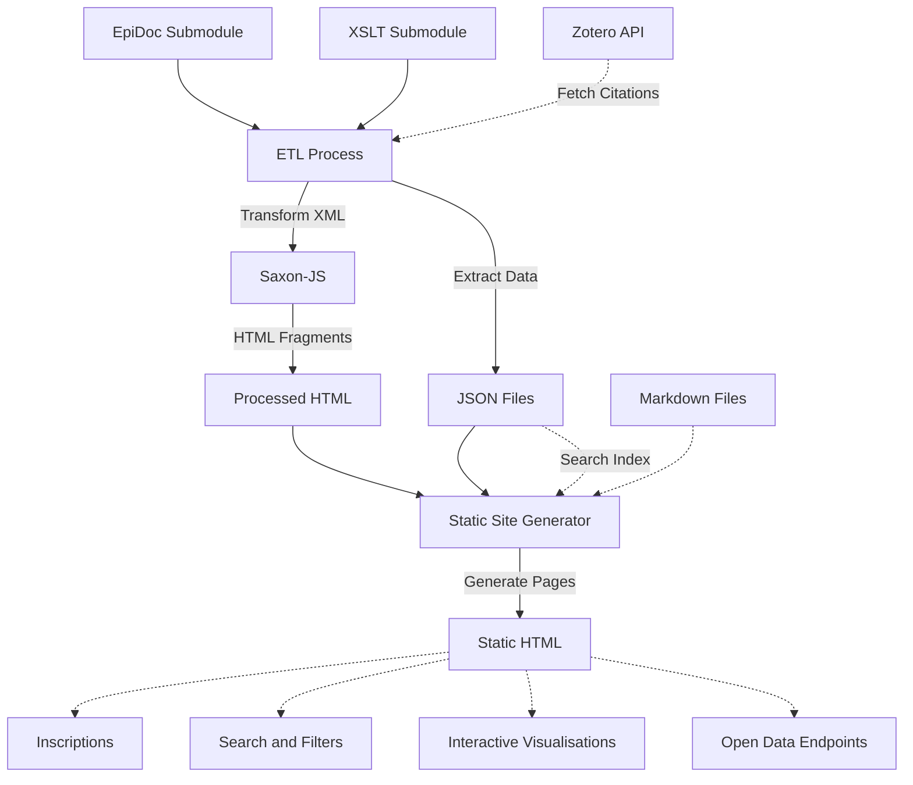

[](https://github.com/kingsdigitallab/corpus-building/actions/workflows/frontend.yml)

# Corpus Building

This project processes [EpiDoc](https://epidoc.stoa.org) [TEI](https://tei-c.org)
XML files and presents them as a static website.

It uses a monorepo structure with two main components: an [ETL](packages/etl)
(Extract, Transform, Load) process for handling XML files, and a
[web application](frontend/README.md) for presenting the processed data.

## Project structure

The main components of the project are:

- `packages/`
  - [`etl/`](packages/etl/README.md): ETL package for processing XML
- [`frontend/`](frontend/README.md): Static site generator web application
- `data/`
  - `processed/`: Output data generated by the `etl` package after processing the `raw` data
  - `raw/`: Git submodule for the [EpiDoc files](https://github.com/kingsdigitallab/ISicily)
- `xslt/`
  - `epidoc/`: Git submodule for [XSLT stylesheets](https://github.com/kingsdigitallab/corpus-building-epidoc-stylesheets)
  - `start-edition.sef.json`: Compiled version of the XSLT to convert the XML files into HTML

## Workflow


```mermaid
graph TD
A[EpiDoc Submodule] --> B[ETL Process]
X[XSLT Submodule] --> B
Z[Zotero API] -.->|Fetch Citations| B
B -->|Transform XML| C[Saxon-JS]
C -->|HTML Fragments| D[Processed HTML]
B -->|Extract Data| E[JSON Files]
D --> F[Static Site Generator]
E --> F
G[Markdown Files] -.-> F
F -->|Generate Pages| H[Static HTML]
E -.->|Search Index| F
H -.-> I[Inscriptions]
H -.-> K[Search and Filters]
H -.-> J[Interactive Visualisations]
H -.-> L[Open Data Endpoints]
```

## Prerequisites

- [Node.js](https://nodejs.org) 20+ (see `.mise.toml`)

## Getting started

1. Clone this repository
1. Initialise and update the submodules

   ```sh
   git submodule update --init --recursive
   ```

1. Install dependencies

   ```sh
   npm install
   ```

1. Run the etl process

   ```sh
   npm run etl
   ```

1. Run the development server

   ```sh
   npm run frontend:dev
   ```

The project should be available at http://localhost:5173/.

## Testing

The project uses a comprehensive testing strategy covering pure functions (Vitest) and end-to-end integration/accessibility (Playwright).

To run all tests across the entire monorepo (both ETL and frontend):

```sh
npm test
```

You can also run tests for specific workspaces from the root:

- `npm run test:etl` — Run ETL unit tests only
- `npm run test:frontend` — Run all frontend tests (unit + integration)
- `npm run test:integration` — Run Playwright frontend integration/accessibility tests only

## Editorial and Release Workflows

More information about [Editorial and Release Workflows](docs/editorial-and-release-workflows.md).

## How to cite

```bibtex
@software{King_s_Digital_Lab_and_Vieira_Corpus_building_edition_2026,
author = {{King's Digital Lab} and Vieira, Miguel and Lu, Zihao and Ciula, Arianna and Prag, Jonathan},
license = {MIT},
month = jun,
title = {{Corpus building edition}},
url = {https://github.com/kingsdigitallab/corpus-building},
version = {v0.27.2},
year = {2026}
}
```

(Generated from codemeta.json)
