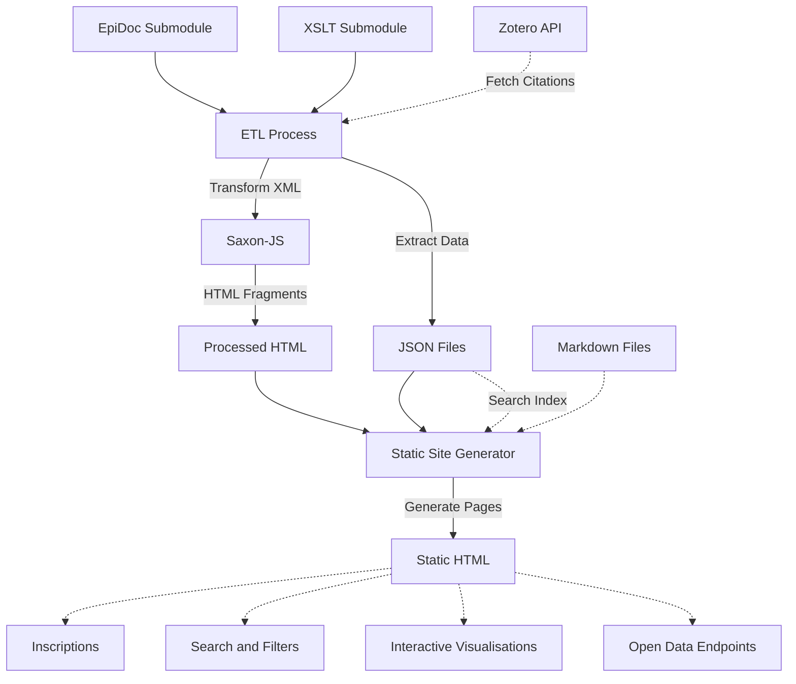

[](https://github.com/kingsdigitallab/corpus-building/actions/workflows/frontend.yml)

# Corpus Building

This project processes [EpiDoc](https://epidoc.stoa.org) [TEI](https://tei-c.org)
XML files and presents them as a static website.

It uses a monorepo structure with two main components: an [ETL](packages/etl)
(Extract, Transform, Load) process for handling XML files, and a
[web application](frontend/README.md) for presenting the processed data.

## Project structure

The main components of the project are:

- `packages/`
  - [`etl/`](packages/etl/README.md): ETL package for processing XML
- [`frontend/`](frontend/README.md): Static site generator web application
- `data/`
  - `processed/`: Output data generated by the `etl` package after processing the `raw` data
  - `raw/`: Git submodule for the [EpiDoc files](https://github.com/kingsdigitallab/ISicily)
- `xslt/`
  - `epidoc/`: Git submodule for [XSLT stylesheets](https://github.com/kingsdigitallab/corpus-building-epidoc-stylesheets)
  - `start-edition.sef.json`: Compiled version of the XSLT to convert the XML files into HTML

## Workflow


```mermaid
graph TD
A[EpiDoc Submodule] --> B[ETL Process]
X[XSLT Submodule] --> B
Z[Zotero API] -.->|Fetch Citations| B
B -->|Transform XML| C[Saxon-JS]
C -->|HTML Fragments| D[Processed HTML]
B -->|Extract Data| E[JSON Files]
D --> F[Static Site Generator]
E --> F
G[Markdown Files] -.-> F
F -->|Generate Pages| H[Static HTML]
E -.->|Search Index| F
H -.-> I[Inscriptions]
H -.-> K[Search and Filters]
H -.-> J[Interactive Visualisations]
H -.-> L[Open Data Endpoints]
```

## Prerequisites

- [Node.js](https://nodejs.org) 20+ (see `.mise.toml`)

## Getting started

1. Clone this repository
1. Initialise and update the submodules

   ```sh
   git submodule update --init --recursive
   ```

1. Install dependencies

   ```sh
   npm install
   ```

1. Run the etl process

   ```sh
   npm run etl
   ```

1. Run the development server

   ```sh
   npm run frontend:dev
   ```

The project should be available at http://localhost:5173/.

## Testing

The project uses a comprehensive testing strategy covering pure functions (Vitest) and end-to-end integration/accessibility (Playwright).

To run all tests across the entire monorepo (both ETL and frontend):

```sh
npm test
```

You can also run tests for specific workspaces from the root:

- `npm run test:etl` — Run ETL unit tests only
- `npm run test:frontend` — Run all frontend tests (unit + integration)
- `npm run test:integration` — Run Playwright frontend integration/accessibility tests only

## Adding content to the site

See the [frontend README](frontend/README.md#adding-content) for instructions on
how to add static pages to the site via markdown files.

## Editorial and release workflow

Changes to the content or code should normally happen on the `develop` branch. 
Any commit on that branch will automatically trigger a release to the **[staging/preview site](https://kingsdigitallab.github.io/corpus-building/)**.

Once the changes accumulated on the staging site are ready for public release
they can be merged into the `main` branch by a developer or with [a new Pull Request](https://github.com/kingsdigitallab/corpus-building/compare/main...develop).
Any update of that branch will automatically trigger a release to the Oxford **[public/live/production site](https://sicily.classics.ox.ac.uk/)** via SSH.

In both cases [the automated release process](https://github.com/kingsdigitallab/corpus-building/blob/main/.github/workflows/frontend.yml) from a modified branch first does the following:
1. fetches the latest version of the TEI corpus from https://github.com/ISicily/ISicily
2. run the ETL process from that corpus to rebuild the site metadata and indices
3. run some automated tests and stops the release if they fail
4. commit the updated metadata and indices to the branch

The release process may take up to 30 minutes to complete. 
[Current and past release workflows are visible on the Actions tab](https://github.com/kingsdigitallab/corpus-building/actions) 
of the repository. 
There can be a slight delay between the end of the action 
and the actual refresh of the content on the target site. 
Also note that [hard-refresh in your browser](https://www.wikihow.com/Force-Refresh-in-Your-Internet-Browser) 
may be needed to flush old, cached content.

Small **hot fixes** to the code or content of the live site can be done 
with a Pull Request directly on the `main` branch. 
In that situation extra care should be taken when verifying the changes.

## How to cite

```bibtex
@software{King_s_Digital_Lab_and_Vieira_Corpus_building_edition_2026,
author = {{King's Digital Lab} and Vieira, Miguel and Lu, Zihao and Ciula, Arianna and Prag, Jonathan},
license = {MIT},
month = jun,
title = {{Corpus building edition}},
url = {https://github.com/kingsdigitallab/corpus-building},
version = {v0.27.2},
year = {2026}
}
```

(Generated from codemeta.json)
